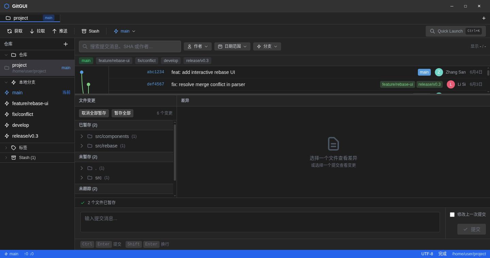

# Majie 码界

面向国内开发者的现代 Git 图形化客户端，原生中文、深度集成国内平台。

## 截图



## 功能特性

### 核心体验
- 🎨 **Fork 风格提交图** — 直线分支算法 + 可折叠合并提交 + 节点分层 + 拖拽交互
- 📋 **Quick Launch 命令面板** — Ctrl+K 快速执行任何操作
- 🌿 **完整分支操作** — 创建/切换/删除/重命名/合并/拖拽合并/Cherry-pick
- 🔀 **交互式 Rebase** — 可视化提交列表 + pick/squash/reword/edit/drop + --update-refs
- ⚔️ **三窗格冲突解决器** — THEIRS/MERGED/YOURS 三窗格 + 冲突预判 + 滚动条冲突标记
- 📝 **增强 CommitBar** — Conventional Commits 模板 + Amend 标记 + 最近提交消息选择
- 🔍 **DiffView 增强** — 词级高亮 + 行级暂存 + Diff minimap + ↩︎段落标记 + 3种diff算法

### Git 工作流
- 🌊 **Git Flow** — Feature/Release/Hotfix 全套工作流
- 🏷️ **标签管理** — 创建/删除/检出/推送标签 + Pin 固定
- 📦 **Stash 管理** — Stash/Pop/Apply/Drop + 部分 Stash(-p) + 提交图中 Stash 节点
- 🗑️ **陈旧分支清理** — 一键查询已合并分支并批量删除
- ↩️ **Undo/Redo 安全网** — 14 种可撤销操作 + Ctrl+Z / Ctrl+Shift+Z

### 远程与集成
- 🔗 **远程仓库管理** — 侧边栏 Remotes 区块 + 添加/删除/修改 URL
- 🔔 **GitHub 通知** — Token 配置 + 未读通知列表 + 跳转浏览器
- 🇨🇳 **Gitee 深度集成** — OAuth 登录 + PR 管理
- 🤖 **AI 集成** — 生成提交消息 + 代码审查 + 支持 Ollama 本地模型

### 可视化与工具
- 📊 **Treemap 磁盘占用** — 仓库文件大小可视化 + 扩展名分组
- 📈 **Reflog 查看** — 操作历史浏览 + Reset/Detach 恢复
- 🕐 **Activity Manager** — 操作活动日志管理器
- 📋 **粘贴 Patch** — 从剪贴板粘贴并应用 patch
- 🧩 **子模块管理** — 添加/初始化/更新/删除
- 🛠️ **外部 Diff/Merge 工具** — 12 种工具配置 + VSCode 深度适配
- ⚡ **自定义命令** — checkbox/input 参数支持
- ✏️ **.gitignore 编辑器** — 可视化弹窗 + 快捷规则
- 🌐 **中英文 i18n** — 完整语言包，默认中文

## 技术栈

| 技术 | 说明 |
|------|------|
| Electron 33+ | 跨平台桌面应用框架 |
| React 19 | UI 组件库 |
| TypeScript | 类型安全 |
| Vite | 快速构建工具 |
| Zustand | 状态管理 |
| Tailwind CSS | 样式框架 |
| isomorphic-git + git CLI | Git 操作双引擎 |

## 项目结构

```
├── main/                    # Electron 主进程
│   ├── index.ts            # 应用入口
│   ├── ipc/                # IPC 通信处理
│   └── services/           # 后端服务（Git、凭证）
├── preload/                 # 预加载脚本
├── renderer/                # 渲染进程（React UI）
│   ├── App.tsx             # 根组件
│   ├── components/         # UI 组件
│   ├── hooks/              # React Hooks
│   ├── i18n/               # 国际化（zh-CN / en-US）
│   ├── stores/             # Zustand 状态管理
│   └── styles/             # 样式
├── shared/                  # 共享类型定义
├── resources/               # 应用图标
└── docs/                    # 文档
    ├── PRD.md              # 产品需求文档
    ├── TECH_DESIGN.md      # 技术架构文档
    ├── FEATURE_STATUS.md   # 功能现状清单
    └── TEST_AND_OPTIMIZATION_PLAN.md  # 测试与优化规划
```

## 快速开始

### 环境要求

- Node.js 18+
- Git（部分功能需要）

### 安装与运行

```bash
# 克隆仓库
git clone https://github.com/zhouqinglong520/Majie.git
cd Majie

# 安装依赖
npm install

# 开发模式启动
npm run dev
```

或使用一键启动脚本：
- Windows: 双击 `start.bat`
- macOS/Linux: `chmod +x start.sh && ./start.sh`

### 构建 & 打包

```bash
# 构建
npm run build

# 打包 Windows 安装程序
npm run package
```

## 快捷键

| 快捷键 | 功能 |
|--------|------|
| Ctrl+K | Quick Launch 命令面板 |
| Ctrl+Z | Undo 撤销 |
| Ctrl+Shift+Z | Redo 重做 |
| Ctrl+O | 打开仓库 |
| F5 | 刷新 |

## 文档

- [产品需求文档](docs/PRD.md)
- [技术架构文档](docs/TECH_DESIGN.md)
- [功能现状清单](docs/FEATURE_STATUS.md) — 34 项已完成功能详情
- [测试与优化规划](docs/TEST_AND_OPTIMIZATION_PLAN.md) — 36 项测试用例 + 三阶段优化

## License

MIT
